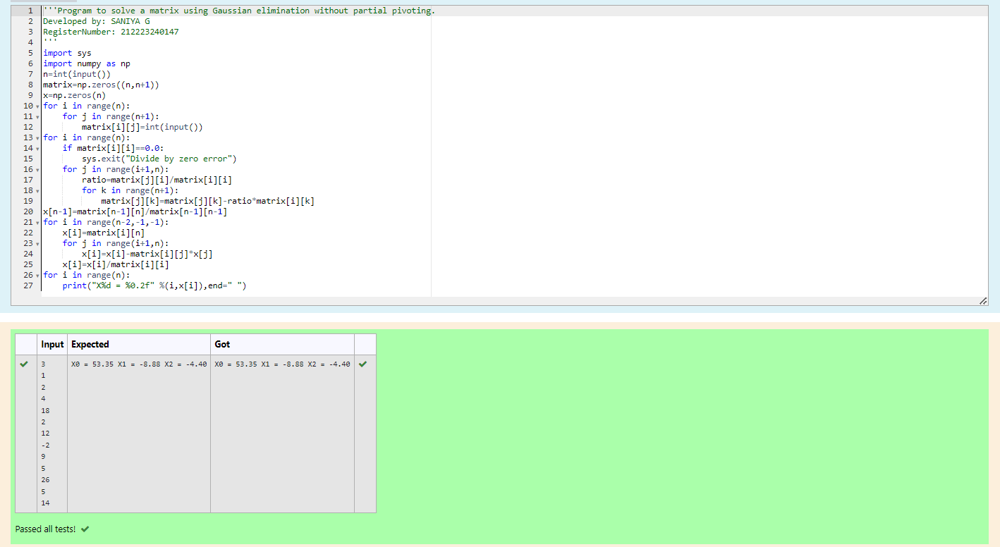

# Gaussian Elimination

## AIM:
To write a program to find the solution of a matrix using Gaussian Elimination.

## Equipments Required:
1. Hardware – PCs
2. Anaconda – Python 3.7 Installation / Moodle-Code Runner

## Algorithm
1. Import the numpy module to use the built in function for calculation.
2. Import the sys function.Get input from the user for the matrix i and j using for loop.
3. Check wheather the matrix of element is divisible by zero then print zero is detected.
4. End of the program.

## Program:
```
Program to find the solution of a matrix using Gaussian Elimination.
Developed by: SANIYA G
RegisterNumber: 23002553

import sys
import numpy as np
n=int(input())
matrix=np.zeros((n,n+1))
x=np.zeros(n)
for i in range(n):
    for j in range(n+1):
        matrix[i][j]=int(input())
for i in range(n):
    if matrix[i][i]==0.0:
        sys.exit("Divide by zero error")
    for j in range(i+1,n):
        ratio=matrix[j][i]/matrix[i][i]
        for k in range(n+1):
            matrix[j][k]=matrix[j][k]-ratio*matrix[i][k]
x[n-1]=matrix[n-1][n]/matrix[n-1][n-1]
for i in range(n-2,-1,-1):
    x[i]=matrix[i][n]
    for j in range(i+1,n):
        x[i]=x[i]-matrix[i][j]*x[j]
    x[i]=x[i]/matrix[i][i]
for i in range(n):
    print("X%d = %0.2f" %(i,x[i]),end=" ")
```

## Output:



## Result:
Thus the program to find the solution of a matrix using Gaussian Elimination is written and verified using python programming.

